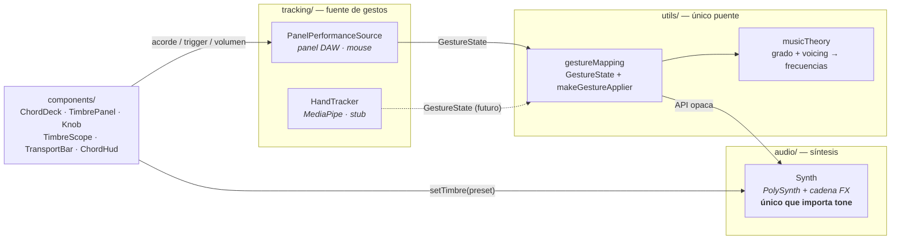
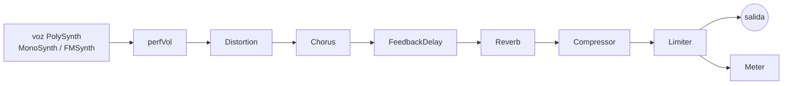

# GestureSynth

> Instrumento musical de acordes para el navegador. Sintetizador de acompañamiento
> con control tipo plugin de DAW — hoy con el mouse, mañana con la mano por webcam.

<!-- Añade una captura en docs/screenshot.png y descomenta la línea siguiente -->
<!--  -->

---

## Qué es

**GestureSynth** es una pieza de portafolio: un instrumento interactivo en tiempo
real, 100 % en el navegador, que traducirá gestos de mano (MediaPipe) en síntesis
de sonido y feedback visual.

Este repo contiene la **primera fase — el módulo de audio, aislado**: sin cámara
ni MediaPipe todavía. El instrumento se toca y se edita con un panel tipo DAW
controlado con el mouse. La capa de tracking real (`HandTracker`) entra después
sin tocar el motor de audio: el contrato entre ambos lados ya está congelado.

- **100 % armónico.** Solo se tocan acordes; la calidad del acorde es el foco.
- **Acordes por grado.** La raíz se elige como grado dentro de una tonalidad
  (I–VII), no como frecuencia — así se habla en términos musicales y se cambia
  de tonalidad al vuelo.
- **Timbre editable en caliente**, con presets serializables (JSON) y un motor
  sustractivo o FM según el preset.

---

## Demo rápida

```bash
npm install
npm run dev        # abre http://localhost:5173
```

1. Pulsa **Empezar** (obligatorio: el audio necesita un gesto del usuario).
2. Mantén pulsado un pad **I–VII** → suena el acorde mientras lo sostienes.
3. Cambia tonalidad / calidad / voicing / octava a la izquierda.
4. A la derecha, elige un **Preset** y mueve los 4 macros
   (*Brightness · Thickness · Space · Motion*) o abre **Advanced**.

```bash
npm run build      # tsc + build de producción
npm test           # 34 tests (Vitest)
```

---

## Arquitectura

Regla **no negociable**: `tracking/` y `audio/` no se conocen entre sí. El único
puente es `utils/gestureMapping.ts`, y **solo `audio/Synth.ts` importa `tone`**.



**Contrato congelado** (`GestureState`): lo produce hoy `PanelPerformanceSource`
y mañana `HandTracker`, con la misma interfaz `subscribe(cb)` / `dispose()`.
`makeGestureApplier(synth)` es lo único que traduce ese estado a llamadas del
`Synth` y **no cambia** cuando se conecte la cámara.

```ts
interface ChordIntent  { key: string; degree: 1..7; quality: "major"|"minor"; voicing: 1..5; octave: -1..1 }
interface GestureState { chord: ChordIntent; volumeDb: number; triggerActive: boolean }
```

### Cadena de audio (dentro de `Synth`)



El filtrado es **por voz** (dentro de `MonoSynth`, con envolvente de filtro
propia); el motor FM no filtra.

---

## El instrumento

### Acordes — `ChordDeck`

| Control | Opciones |
|---|---|
| **Tonalidad** | 12 tónicas cromáticas |
| **Grado** | pads I–VII (fila mayor) + i–vii (fila menor); *hold-to-play* |
| **Voicing** | 1–5 (ver tabla) |
| **Octava** | −1 / 0 / +1 |

Cada pad lleva su propia calidad, así se combinan libremente acordes mayores y
menores de cualquier grado (dominantes secundarias, préstamos tonales…).

| Voicing | Nombre | Mayor | Menor |
|:---:|---|---|---|
| **1** | Tríada fundamental | R · 3 · 5 | R · ♭3 · 5 |
| **2** | 1ª inversión | 3 · 5 · 8 | ♭3 · 5 · 8 |
| **3** | Séptima | maj7 | m7 |
| **4** | Dominante / disminuido | 7 | °7 |
| **5** | Quinta alterada *(sin séptima)* | aumentado ♯5 | disminuido ♭5 |

### Timbre — `TimbrePanel`

- **4 macros musicales** como control principal: **Brightness** (corte),
  **Thickness** (unísono/detune o índice FM), **Space** (reverb + delay),
  **Motion** (envolvente de filtro).
- Bloque **Advanced** plegable: secciones *Oscillator · Filter · Envelope ·
  Effects* con los parámetros sueltos, en **potenciómetros** (arrastre vertical,
  `Shift` = fino, doble clic = reset, rueda, flechas).
- **Visualizador** (`TimbreScope`): 3 paneles dibujados solo con los números del
  preset — forma de onda del oscilador (reacciona al tipo de onda y, en FM, a
  Ratio / FM Amount), respuesta del filtro y forma de la envolvente.
- Todo pasa por `Synth.setTimbre(preset)`; la UI nunca toca un nodo de Tone.

### Presets

14 presets de fábrica en dos grupos del dropdown:

| Grupo | Preset | Motor | Carácter |
|---|---|:---:|---|
| **Basic** | Clean | sustr. | seno/triángulo limpio, punto de partida |
| | Keys | sustr. | teclado con envolvente de filtro |
| | Warm Pad | sustr. | pad saw con unísono ancho |
| | Pluck | sustr. | pizzicato corto y resonante |
| | Brass | sustr. | metales con ataque medio |
| | Gritty | sustr. | cuadrada saturada |
| | E-Piano | **FM** | piano eléctrico tipo DX |
| | Bells | **FM** | campanas metálicas |
| **Joji / ballad** | Ballad Lead | sustr. | pad-lead cálido moderno *(ref. «Die For You»)* |
| | Hazy Pad | sustr. | pad lento y difuso *(«Slow Dancing…» / «Run»)* |
| | Mellow Rhodes | **FM** | Rhodes filtrado *(«Demons» / «Test Drive»)* |
| | Cold Bells | **FM** | campana FM fría *(«Ew» / «Pretty Boy»)* |
| | Felt Keys | sustr. | teclas suaves *(≈ «Glimpse of Us»)* |
| | Dark Wash | sustr. | cama de fondo con reverb enorme |

> El grano de casete/lo-fi que define esos discos necesita nodos que el motor aún
> no tiene (BitCrusher/Chebyshev, ruido, EQ3). Los presets clavan el carácter
> (pad/EP/campana), no la degradación. Ver *Roadmap*.

---

## Estructura del proyecto

```
src/
├── main.ts                      Arranque: instancia Synth, cablea la fuente → makeGestureApplier
├── style.css                    Tema oscuro, layout de 2 columnas
├── components/
│   ├── ChordDeck.ts             Izquierda: tonalidad, voicing, octava y pads I–VII / i–vii
│   ├── TimbrePanel.ts           Derecha: preset, 4 macros y bloque "Advanced"
│   ├── Knob.ts                  Potenciómetro reutilizable (sin tone)
│   ├── TimbreScope.ts           Visualizador: onda + filtro + envolvente (sin tone)
│   ├── TransportBar.ts          Botón "Empezar", volumen master, medidor
│   └── ChordHud.ts              Nombre del acorde activo + notas
├── audio/
│   ├── Synth.ts                 PolySynth (MonoSynth/FMSynth) + cadena FX — ÚNICO que importa tone
│   ├── Engine.ts                stub (orquestador tracking↔audio, roadmap)
│   └── presets/
│       ├── types.ts             TimbrePreset v2 (esquema anidado + version + engine)
│       ├── index.ts             carga, PRESET_GROUPS, migratePreset (v1 → v2), clonePreset
│       └── *.json               14 presets
├── tracking/
│   ├── PanelPerformanceSource.ts  Temporal: eventos del panel DAW → GestureState
│   └── HandTracker.ts             stub (MediaPipe Hand Landmarker, roadmap)
└── utils/
    ├── gestureMapping.ts        GestureState + makeGestureApplier — ÚNICO puente
    └── musicTheory.ts           tonalidad + grado + calidad + voicing → frecuencias
```

Tests: `*.test.ts` junto a su módulo (`musicTheory`, `presets`, `TimbrePanel` con
happy-dom).

---

## Stack

| Área | Elección | Por qué |
|---|---|---|
| Build | **Vite 5 + TypeScript** vanilla | el loop de audio/canvas corre fuera de cualquier ciclo de render declarativo; sin framework |
| Audio | **Tone.js 15** (`PolySynth`) | timbre editable en caliente y presets serializables vía `set()` / `get()` |
| Tests | **Vitest 2** (+ happy-dom) | teoría musical, esquema de presets y UI del panel de timbre |
| Visión *(futuro)* | MediaPipe Hand Landmarker | 21 landmarks 3D + handedness por mano |

---

## Scripts

| Comando | Acción |
|---|---|
| `npm run dev` | servidor de desarrollo (Vite) |
| `npm run build` | `tsc` + build de producción a `dist/` |
| `npm run preview` | sirve el build de producción |
| `npm test` | ejecuta los tests una vez |
| `npm run test:watch` | tests en modo watch |

---

## Estado y roadmap

**Hecho**

- [x] Motor de audio aislado: `Synth` opaco, cadena FX, medidor
- [x] Acordes por grado × calidad × voicing (1–5) × octava
- [x] Panel de timbre: presets, macros, sección avanzada, potenciómetros
- [x] Visualizador de onda / filtro / envolvente
- [x] Motor conmutable sustractivo ↔ FM por preset
- [x] 14 presets (banco básico + banco «Joji / ballad»)
- [x] Contrato `GestureState` congelado + `PanelPerformanceSource` temporal

**Siguiente**

- [ ] FX para lo-fi: `BitCrusher` / `Chebyshev`, oscilador de ruido, `EQ3`
- [ ] `tracking/HandTracker.ts`: MediaPipe Hand Landmarker → `GestureState`
      (mano izquierda = timbre, derecha = performance; pinza con histéresis;
      suavizado de landmarks)
- [ ] `audio/Engine.ts`: orquestador del loop tracking ↔ audio a 30–60 fps
- [ ] Feed de cámara + esqueleto de mano en canvas
- [ ] Pulido visual / UX; v2 opcional con Three.js

---

## Notas de diseño

- **`Synth` es una caja opaca.** API pública: `setChord(freqs[])`, `setVolume`,
  `noteOn`, `noteOff`, `setTimbre`, `getCurrentTimbre`, `getLevel`, `start`.
  Nadie fuera de `Synth` toca un `AudioParam` ni un nodo de Tone.
- **La teoría musical vive en `utils/`,** nunca en `Synth`: `musicTheory.ts`
  resuelve tonalidad + grado + voicing → `number[]` de frecuencias.
- **El `decay` de la reverb solo se aplica al cargar un preset** (regenera la IR,
  es asíncrono y costoso); los macros nunca lo tocan.
- **La UI del timbre está en inglés** por convención de los sintetizadores
  virtuales; el resto de la interfaz, en español.

