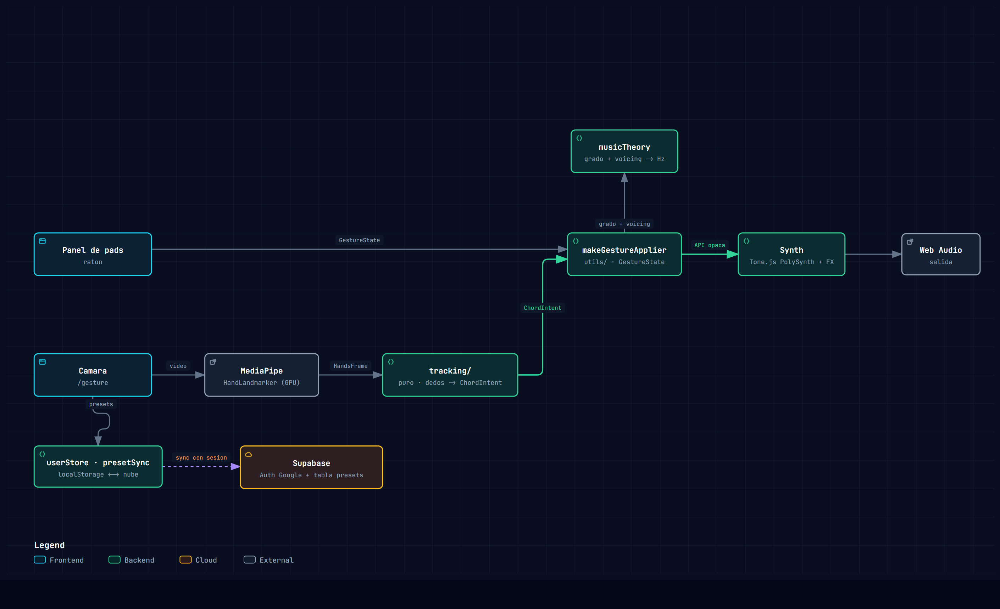
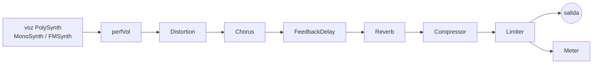
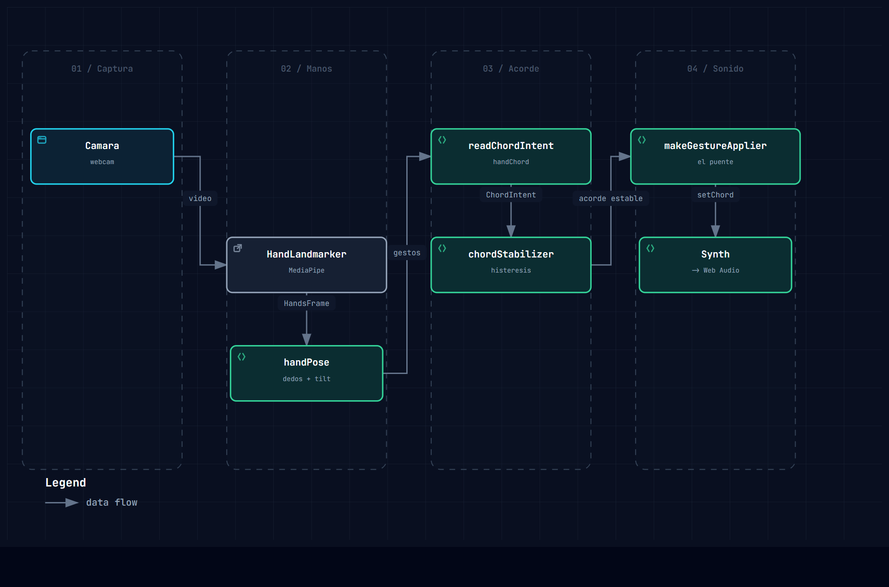

# GestureSynth

> Instrumento musical de acordes para el navegador. Sintetizador de acompañamiento
> con control tipo plugin de DAW — hoy con el mouse, mañana con la mano por webcam.

<!-- Añade una captura en docs/screenshot.png y descomenta la línea siguiente -->
<!--  -->

---

## Qué es

**GestureSynth** es una pieza de portafolio: un instrumento interactivo en tiempo
real, 100 % en el navegador, que traducirá gestos de mano (MediaPipe) en síntesis
de sonido y feedback visual.

La **fase 1** (módulo de audio, aislado) está cerrada: el instrumento se toca y
se edita con un panel tipo DAW controlado con el mouse, y el contrato entre
tracking y audio ya está congelado.

La **fase 2** vive en **`/gesture`**: manos por cámara con MediaPipe (21
landmarks + lado por mano); la izquierda da el grado (dedos) y la calidad
mayor/menor (inclinación), la derecha la forma del acorde (dedos + pulgar). **Ya
suena**: el acorde que leen las manos entra al mismo `Synth` por el puente
`makeGestureApplier`. Ver [Fase 2 · `/gesture`](#fase-2--gesture).

- **100 % armónico.** Solo se tocan acordes; la calidad del acorde es el foco.
- **Acordes por grado.** La raíz se elige como grado dentro de una tonalidad
  (I–VII), no como frecuencia — así se habla en términos musicales y se cambia
  de tonalidad al vuelo.
- **Timbre editable en caliente**, con presets serializables (JSON) y un motor
  sustractivo o FM según el preset.

La página **`/about`** (3ª entrada de la MPA, `about.html` → `src/about.ts`)
resume qué es / qué hace / cómo lo hace, y enlaza a dos diagramas interactivos
generados con [archify](https://github.com/tt-a1i/archify) —
`public/diagrams/{arquitectura,pipeline-manos}.html`, con sus fuentes en
`docs/diagrams/*.json`.

---

## Demo rápida

```bash
npm install
npm run dev        # abre http://localhost:5173
```

1. Pulsa **Empezar** (obligatorio: el audio necesita un gesto del usuario).
2. Mantén pulsado un pad **I–VII** → suena el acorde mientras lo sostienes.
3. Cambia tonalidad / calidad / voicing / octava a la izquierda.
4. A la derecha, elige un **Preset** y mueve los 4 macros
   (*Brightness · Thickness · Space · Motion*) o abre **Advanced**.

```bash
npm run build      # tsc + build de producción
npm test           # 101 tests (Vitest)
```

Para la página `/gesture` hacen falta los assets de MediaPipe (wasm + modelo). Se
copian solos en `postinstall`; para forzarlo: `npm run setup:mediapipe`. Van a
`public/mediapipe/` y **no** se versionan.

---

## Arquitectura

Regla **no negociable**: `tracking/` y `audio/` no se conocen entre sí. El único
puente es `utils/gestureMapping.ts`; **solo `audio/Synth.ts` importa `tone`** y
**solo `tracking/HandLandmarker.ts` importa `@mediapipe/tasks-vision`**.



<sub>Diagrama interactivo (pan/zoom, tema, trazado): [`/about`](https://soundstation-motion.vercel.app/about) · fuente `public/diagrams/arquitectura.html` (spec en `docs/diagrams/arquitectura.architecture.json`, hecho con [archify](https://github.com/tt-a1i/archify)).</sub>

`HandLandmarkerSource` (`/gesture`) captura 21 landmarks + lado por mano;
`handChord.readChordIntent` los convierte en `ChordIntent` y `src/gesture.ts` lo
manda a `makeGestureApplier(synth)` cada frame. `HandTracker` (stub) sería el
envoltorio con la interfaz `subscribe`/`dispose` para correr el instrumento
entero por cámara desde `main.ts`.

**Contrato congelado** (`GestureState`): lo produce hoy `PanelPerformanceSource`
y mañana `HandTracker`, con la misma interfaz `subscribe(cb)` / `dispose()`.
`makeGestureApplier(synth)` es lo único que traduce ese estado a llamadas del
`Synth` y **no cambia** cuando se conecte la cámara.

```ts
interface ChordIntent  { key: string; keyMode: "major"|"minor"; degree: 1..7; quality: "major"|"minor"; voicing: 1..8; octave: -1..1 }
interface GestureState { chord: ChordIntent; volumeDb: number; triggerActive: boolean }
```

### Cadena de audio (dentro de `Synth`)



El filtrado es **por voz** (dentro de `MonoSynth`, con envolvente de filtro
propia); el motor FM no filtra.

---

## El instrumento

### Acordes — `ChordDeck`

| Control | Opciones |
|---|---|
| **Tonalidad** | 12 tónicas cromáticas |
| **Modo** | mayor / menor natural → las 12 tonalidades mayores y las 12 menores (cambia de qué escala salen las raíces de los grados) |
| **Nomenclatura** | sigue el círculo de quintas: las tonalidades del lado bemol (F, B♭, E♭, A♭, D♭ / Dm, Gm, Cm, Fm, B♭m, E♭m) se escriben con `b`; el resto con `#`. Los nombres de nota del HUD heredan esa grafía |
| **Grado** | pads I–VII (fila mayor) + i–vii (fila menor); *hold-to-play*. Cada pad muestra el cifrado real que dispara (p. ej. `C`, `Dm`, `Gmaj7`), recalculado con la tónica / el modo / el voicing vigentes |
| **Voicing** | 1–8 (ver tabla) |
| **Octava** | −1 / 0 / +1 |

Cada pad lleva su propia calidad, así se combinan libremente acordes mayores y
menores de cualquier grado (dominantes secundarias, préstamos tonales…).

| Voicing | Nombre | Mayor | Menor |
|:---:|---|---|---|
| **1** | Tríada fundamental | R · 3 · 5 | R · ♭3 · 5 |
| **2** | Inversión 5-1-3 *(5ª al bajo, 8ª abajo)* | 5 · 1 · 3 | 5 · 1 · ♭3 |
| **3** | Séptima | maj7 | m7 |
| **4** | Dominante / disminuido | 7 | °7 |
| **5** | Quinta alterada *(sin séptima)* | aumentado ♯5 | disminuido ♭5 |
| **6** | Séptima invertida 5-1-3-7 *(5ª al bajo, 8ª abajo)* | maj7/inv | m7/inv |
| **7** | Dominante / dim7 invertida *(5ª del acorde al bajo)* | 7/inv | dim7/inv |
| **8** | Aumentada / disminuida invertida *(5ª alterada al bajo)* | (♯5)/inv | (♭5)/inv |

### Timbre — `TimbrePanel`

- **4 macros musicales** como control principal: **Brightness** (corte),
  **Thickness** (unísono/detune o índice FM), **Space** (reverb + delay),
  **Motion** (envolvente de filtro).
- Bloque **Advanced** plegable: secciones *Oscillator · Filter · Envelope ·
  Effects* con los parámetros sueltos, en **potenciómetros** (arrastre vertical,
  `Shift` = fino, doble clic = reset, rueda, flechas).
- **Visualizador** (`TimbreScope`): 3 paneles dibujados solo con los números del
  preset — forma de onda del oscilador (reacciona al tipo de onda y, en FM, a
  Ratio / FM Amount), respuesta del filtro y forma de la envolvente.
- **Guardar presets propios**: escribe un nombre y pulsa *Save* → el timbre
  actual se guarda en `localStorage` (`audio/presets/userStore.ts`) con el mismo
  esquema `TimbrePreset` v2, y aparece en el grupo *My presets* del dropdown;
  *Delete* lo quita. Un preset guardado se puede copiar tal cual a un `.json` del
  repo.
- Todo pasa por `Synth.setTimbre(preset)`; la UI nunca toca un nodo de Tone.

### Presets

20 presets de fábrica en tres grupos del dropdown:

| Grupo | Preset | Motor | Carácter |
|---|---|:---:|---|
| **Basic** | Clean | sustr. | seno/triángulo limpio, punto de partida |
| | Keys | sustr. | teclado con envolvente de filtro |
| | Warm Pad | sustr. | pad saw con unísono ancho |
| | Pluck | sustr. | pizzicato corto y resonante |
| | Brass | sustr. | metales con ataque medio |
| | Gritty | sustr. | cuadrada saturada |
| | E-Piano | **FM** | piano eléctrico tipo DX |
| | Bells | **FM** | campanas metálicas |
| **Joji / ballad** | Ballad Lead | sustr. | pad-lead cálido y abierto *(ref. «Die For You»)* |
| | Hazy Pad | sustr. | pad lento, con cuerpo y algo de aire *(«Run» / «Slow Dancing…»)* |
| | Slow Dance | sustr. | pad saw amplio y profundo, reverb contenida *(«Slow Dancing in the Dark»)* |
| | Mellow Rhodes | **FM** | Rhodes con cola y brillo *(«Demons» / «Test Drive»)* |
| | Cold Bells | **FM** | campana FM más tonal, menos metálica *(«Ew» / «Pretty Boy»)* |
| | Felt Keys | sustr. | teclas suaves con algo de sustain *(≈ «Glimpse of Us»)* |
| | Dark Wash | sustr. | colchón de fondo, oscuro pero con el acorde legible |
| | Warm Dance | sustr. | mezcla de *Warm Synth* × *Slow Dance*: triangular con unísono suave, filtro con movimiento leve, reverb media, entrada blanda |
| | Dark Bed | sustr. | pad oscuro y contenido para acordes con séptima: saw filtrado a 640 Hz, poco unísono, reverb media, master −15 dB (colchón de fondo) |
| **Inspiration · gesture-synth** | Warm Synth | sustr. | triangular a través de un pasa-bajos estático 1200 Hz, sin FX |
| | Bright Synth | sustr. | sierra abierta (corte ~6 kHz), ataque muy lento tipo swell, reverb corta |
| | Retro Synth | sustr. | onda cuadrada, mismo pasa-bajos estático que Warm Synth |

> **Warm Synth** y **Retro Synth** recrean el synth de referencia
> [`ericwei97-cloud/gesture-synth`](https://github.com/ericwei97-cloud/gesture-synth):
> un solo oscilador → lowpass 1200 Hz / Q 0.7, ataque instantáneo, sin FX; el
> preset **es** la forma de onda. **Bright Synth** se reajustó a un pad brillante
> propio (filtro abierto, swell largo, algo de reverb/delay).

> Estos presets van con **poca distorsión, algo más de brillo y cuerpo** para
> que el acorde sea el protagonista y no la textura. El grano de casete/lo-fi de
> esos discos necesita nodos que el motor aún no tiene (BitCrusher/Chebyshev,
> ruido, EQ3). Ver *Roadmap*.

---

## Fase 2 · `/gesture`

Página aparte (Vite MPA: `gesture.html` como segundo entry point; `vite.config.ts`
reescribe la URL limpia `/gesture` → `/gesture.html` en dev y en `preview`, y en
un hosting estático haría falta la misma regla de rewrite). El módulo de audio en
`/` no se toca y **no** carga MediaPipe.

Interfaz al estilo de la referencia de [Eric Wei](https://github.com/ericwei97-cloud/gesture-synth):
**cámara a pantalla completa** (canvas `position:fixed; inset:0`, vídeo con recorte
tipo `object-fit: cover`), en gris atenuado hasta activarla, overlay de *click para
activar*. Columna izquierda (`.gesture-left`): **selector de tónica**
(`KeySelector`; sin menú mayor/menor — la calidad la pone la inclinación de la
mano), **selector de preset** (`PresetSelector`: 20 de fábrica por grupos + los
que hayas guardado en `/`) y un enlace **«crear sonidos ↗»** que lleva a `/`.
Arriba a la derecha un botón **⚙ de opciones** (`GestureOptions`): color
principal de la página (`--gesture-accent`, aplicado a todo el texto) y
*información avanzada* (muestra el HUD de identificación de manos, oculto por
defecto). Las preferencias del ⚙ se guardan en `localStorage`.
`<body data-page="gesture">` activa este layout sin afectar a `/`.



<sub>Cámara → MediaPipe → `handPose` → `readChordIntent` → `chordStabilizer` → `makeGestureApplier` → `Synth`. Interactivo en [`/about`](https://soundstation-motion.vercel.app/about) · `public/diagrams/pipeline-manos.html`.</sub>

Qué hace hoy — **leer el acorde de las dos manos y sonarlo**:

- Cámara (`getUserMedia`) + `HandLandmarker` de `@mediapipe/tasks-vision`
  (`runningMode:"VIDEO"`, `numHands: 2`). Captura **limitada a 1080p**
  (`CameraFeed` con `width/height max`) — una cámara 2K/4K sube muchos menos
  píxeles a la GPU por detección. El HUD muestra la resolución real negociada.
- **Render del vídeo a ~60 fps** (fluido) desacoplado de la **detección**, limitada
  a `DETECT_FPS` (`gesture.ts`, hoy 20): el bucle `requestAnimationFrame` repinta
  el vídeo cada frame y solo llama a `detectForVideo` cuando toca. Subir
  `DETECT_FPS` = menos latencia en los nodos, más coste.
- 21 landmarks por mano dibujados como **nodos blancos** sobre el vídeo espejado
  (sin líneas de esqueleto ni etiquetas, por estética; la identificación Izq/Der
  está en el HUD). `HAND_CONNECTIONS` sigue exportado para un futuro modo esqueleto.
- **Handedness**: MediaPipe ya la da como en un selfie; el preview de `/gesture`
  se muestra espejado, así que `correctHandedness()` (en `tracking/handModel.ts`)
  **respeta** la etiqueta de MediaPipe (verificado con webcam real). Suavizado EMA
  ligero (`smoothing` 0.6) para quitar jitter sin añadir latencia.
- Reparto izquierda/derecha; HUD con nº de manos, lado + confianza, FPS y los
  dedos extendidos de la mano izquierda (`T·I·M·R·P`).
- **Acorde con las dos manos** (`tracking/handPose.ts` lee cada mano,
  `tracking/handChord.ts` las junta en un `ChordIntent` — todo puro y testeado):
  - **Izquierda, dedos → grado** (I–VII): 1–5 dedos → I–V (da igual qué dedos,
    solo el número); **VI** = índice + meñique; **VII** = índice + meñique +
    pulgar — la digitación de la referencia de Eric Wei.
  - **Izquierda, inclinación → calidad**: inclinada a la **derecha = mayor**, a
    la **izquierda = menor** (`handTilt` / `readQuality`: la muñeca respecto al
    tramo de los nudillos 9/13, con zona muerta natural). En la zona muerta
    (vertical) se asume **mayor** para que el cifrado salga siempre completo.
  - **Derecha, dedos → forma**: índice = fundamental; índice + corazón = séptima;
    + anular = séptima dominante; los cuatro (índice→meñique) = aumentado /
    disminuido. El **pulgar** marca 1ª inversión: no aparece en el análisis
    romano, pero sí en el acorde exacto de abajo — notación de barra
    (`Cmaj7/G`, `E7/B`, `Faug/C#`) + notas en el orden del voicing. Cubre las 4
    formas (voicings 2 / 6 / 7 / 8 de `musicTheory.ts`).
  - **Abajo-centro**: arriba el **análisis en números romanos** (`I`, `im7`,
    `V7`, `IVmaj7`, `iidim7`, `III(♯5)`… — mayúscula/minúscula por calidad, la
    `m7` explícita); debajo el **acorde exacto** con sus notas, en la tonalidad
    elegida (`Cm7 · C D♯ G A♯`; con inversión, notación de barra). El HUD
    muestra los dedos de cada mano (`T·I·M·R·P`) y la inclinación de la
    izquierda (`▸`/`◂`).
  - Detección de dedos como en la referencia: punta por encima de la PIP (dedos
    largos) / punta separada de la IP (pulgar, según qué mano).

**Suena**: `src/gesture.ts` pasa ese `ChordIntent` cada frame a
`makeGestureApplier(synth)` — el **mismo puente** que usa el panel DAW por mouse.
Trigger de note on/off = "hay mano izquierda con grado legible" (aún sin gesto de
pinza); volumen fijo a −6 dB; el timbre lo elige el `PresetSelector` de la
columna izquierda (arranca en *Warm Pad*). `synth.start()` va en el click de
*activar la cámara* (gesto de usuario para el `AudioContext`).

**Aislamiento**: `@mediapipe/tasks-vision` solo se importa en
`tracking/HandLandmarker.ts`; `tone` solo en `audio/Synth.ts` (ahora el bundle de
`/gesture` también lo incluye, pero ningún módulo de `tracking/` lo importa).

**Assets**: `npm run setup:mediapipe` (también en `postinstall`) copia el wasm de
`node_modules` y descarga `hand_landmarker.task` a `public/mediapipe/`
(ignorado por git).

---

## Estructura del proyecto

```
src/
├── main.ts                      Arranque app de audio (/): Synth + fuente → makeGestureApplier
├── gesture.ts                   Arranque /gesture: cámara + modelo + Synth; acorde de las manos → makeGestureApplier
├── style.css                    Tema oscuro; layout de audio (2 col.) + bloque /gesture
├── components/
│   ├── ChordDeck.ts             Izquierda: tonalidad, voicing, octava y pads I–VII / i–vii
│   ├── TimbrePanel.ts           Derecha: preset, 4 macros y bloque "Advanced"
│   ├── Knob.ts                  Potenciómetro reutilizable (sin tone)
│   ├── TimbreScope.ts           Visualizador: onda + filtro + envolvente (sin tone)
│   ├── TransportBar.ts          Botón "Empezar", volumen master, medidor
│   ├── ChordHud.ts              Nombre del acorde activo + notas
│   ├── HandOverlayCanvas.ts     /gesture: vídeo a pantalla completa (cover) + nodos blancos (sin tasks-vision)
│   ├── KeySelector.ts           /gesture: selector de tónica (12 cromáticas)
│   ├── PresetSelector.ts        /gesture: selector de preset (fábrica + localStorage) → setTimbre
│   ├── GestureOptions.ts        /gesture: menú ⚙ (color principal, HUD avanzado) + localStorage
│   └── GestureView.ts           /gesture: overlay, acorde abajo-centro, columna izq, emite ChordIntent
├── audio/
│   ├── Synth.ts                 PolySynth (MonoSynth/FMSynth) + cadena FX — ÚNICO que importa tone
│   ├── Engine.ts                stub (orquestador tracking↔audio, roadmap)
│   └── presets/
│       ├── types.ts             TimbrePreset v2 (esquema anidado + version + engine)
│       ├── index.ts             carga, PRESET_GROUPS, migratePreset (v1 → v2), clonePreset
│       ├── userStore.ts         presets del usuario en localStorage (mismo esquema v2)
│       └── *.json               20 presets de fábrica
├── tracking/
│   ├── PanelPerformanceSource.ts  Temporal: eventos del panel DAW → GestureState
│   ├── CameraFeed.ts             getUserMedia + <video> oculto, errores tipados (sin tasks-vision)
│   ├── handModel.ts              PURO: HandsFrame/HandObservation, HAND_CONNECTIONS, correctHandedness, EMA
│   ├── handPose.ts               PURO: dedos, grado, calidad (inclinación), forma/inversión de una mano
│   ├── handChord.ts              PURO: las 2 manos → ChordIntent (readChordIntent)
│   ├── HandLandmarker.ts         HandLandmarkerSource — ÚNICO que importa @mediapipe/tasks-vision
│   └── HandTracker.ts            stub (envoltorio subscribe/dispose → GestureState, roadmap)
└── utils/
    ├── gestureMapping.ts        GestureState + makeGestureApplier — ÚNICO puente
    └── musicTheory.ts           tonalidad + grado + calidad + voicing → frecuencias
```

Tests: `*.test.ts` junto a su módulo — `musicTheory`, `presets`, `handModel`,
`handPose`, `handChord`, y `ChordDeck` / `TimbrePanel` con happy-dom.

---

## Stack

| Área | Elección | Por qué |
|---|---|---|
| Build | **Vite 5 + TypeScript** vanilla | el loop de audio/canvas corre fuera de cualquier ciclo de render declarativo; sin framework |
| Audio | **Tone.js 15** (`PolySynth`) | timbre editable en caliente y presets serializables vía `set()` / `get()` |
| Tests | **Vitest 2** (+ happy-dom) | teoría musical, esquema de presets, modelo de manos y UI |
| Visión | **`@mediapipe/tasks-vision` 1** · `HandLandmarker` | 21 landmarks + lado por mano; aislado en `tracking/HandLandmarker.ts` |

---

## Scripts

| Comando | Acción |
|---|---|
| `npm run dev` | servidor de desarrollo (Vite) |
| `npm run build` | `tsc` + build de producción a `dist/` |
| `npm run preview` | sirve el build de producción |
| `npm test` | ejecuta los tests una vez |
| `npm run test:watch` | tests en modo watch |
| `npm run setup:mediapipe` | copia el wasm + descarga el modelo a `public/mediapipe/` (también en `postinstall`) |

---

## Estado y roadmap

**Hecho**

- [x] Motor de audio aislado: `Synth` opaco, cadena FX, medidor
- [x] Acordes por grado × calidad × voicing (1–8, con inversiones) × octava
- [x] Panel de timbre: presets, macros, sección avanzada, potenciómetros
- [x] Visualizador de onda / filtro / envolvente
- [x] Motor conmutable sustractivo ↔ FM por preset
- [x] 20 presets de fábrica (básico + «Joji / ballad» + «Inspiration»)
- [x] Guardar / borrar presets propios (localStorage, esquema v2 serializable)
- [x] Contrato `GestureState` congelado + `PanelPerformanceSource` temporal
- [x] `/gesture`: cámara a pantalla completa + `HandLandmarker`, identificación de
      manos (21 nodos, lado izq/der, 1080p, render 60 fps / detección 20 fps)
- [x] `/gesture`: mano izquierda → grado + calidad mayor/menor (dedos +
      inclinación: derecha = mayor, izquierda = menor); mano derecha → forma
      (dedos: fundamental / séptima / dominante / aum·dim). Abajo-centro: análisis
      en números romanos + acorde exacto con notas
- [x] `/gesture`: columna izq con selector de tónica + selector de preset +
      enlace «crear sonidos» a `/`; menú ⚙ (color principal, HUD avanzado) con
      preferencias en `localStorage`; inversiones con notación de barra
- [x] `Voicing` 7 / 8 en `musicTheory.ts`: 1ª inversión de dominante·dim7 y de
      aum·dim (aplica a `ChordDeck` y a `/gesture`)
- [x] **`/gesture` suena**: `handChord.readChordIntent` → `makeGestureApplier` →
      `Synth`; trigger = mano izquierda con grado legible

**Siguiente**

- [ ] `/gesture`: volumen por altura de la mano; octava; pinza con histéresis
      para note on/off (en vez de "hay mano izquierda")
- [ ] FX para lo-fi: `BitCrusher` / `Chebyshev`, oscilador de ruido, `EQ3`
- [ ] `tracking/HandTracker.ts`: envoltorio `subscribe`/`dispose` → `GestureState`
      para correr el instrumento entero por cámara desde `main.ts`
- [ ] `audio/Engine.ts`: orquestador del loop tracking ↔ audio a 30–60 fps
- [ ] Pulido visual / UX; v2 opcional con Three.js

---

## Notas de diseño

- **`Synth` es una caja opaca.** API pública: `setChord(freqs[])`, `setVolume`,
  `noteOn`, `noteOff`, `setTimbre`, `getCurrentTimbre`, `getLevel`, `start`.
  Nadie fuera de `Synth` toca un `AudioParam` ni un nodo de Tone.
- **La teoría musical vive en `utils/`,** nunca en `Synth`: `musicTheory.ts`
  resuelve tonalidad + grado + voicing → `number[]` de frecuencias.
- **El `decay` de la reverb solo se aplica al cargar un preset** (regenera la IR,
  es asíncrono y costoso); los macros nunca lo tocan.
- **La UI del timbre está en inglés** por convención de los sintetizadores
  virtuales; el resto de la interfaz, en español.
- **Aislamiento verificable con `grep`:** `from "tone"` → solo `audio/Synth.ts`;
  `from "@mediapipe/tasks-vision"` → solo `tracking/HandLandmarker.ts`. Ningún
  módulo de `tracking/` importa `tone` aunque el bundle de `/gesture` lo incluya.

